# Benchmarks

CPU time and system calls per request of the `durchlauferhitzer` binary, per scenario, measured nightly on GitHub's runners (NFR-PERF-08; data: [`results.csv`](results.csv), tool: `bench/` on `main`).

Method: CPU time is the server process's own utime+stime (`/proc/<pid>/stat`) over the measured window after a warm-up, divided by the complete, correct responses; system calls come from a separate `strace -c -f` pass, divided by that pass's responses.
Each point is the median of a date's runs on one runner (each runner label is its own series); runs with errors are left out (they stay in the CSV). Runner noise is expected: compare trends, not single points.

## Latest

| Scenario | Runner | Date | Commit | CPU µs/req | Syscalls/req | Req/s | RSS KiB |
|---|---|---|---|---:|---:|---:|---:|
| `static-small` | `gha-ubuntu-24.04-x86_64` | 2026-11-13 | `b8b13e4` | 49.28 | 17.80 | 31622 | 3132 |
| `static-large` | `gha-ubuntu-24.04-x86_64` | 2026-11-13 | `b8b13e4` | 279.86 | 37.23 | 4434 | 3144 |
| `static-fresh` | `gha-ubuntu-24.04-x86_64` | 2026-11-13 | `b8b13e4` | 79.31 | 26.40 | 16313 | 3176 |
| `proxy-small` | `gha-ubuntu-24.04-x86_64` | 2026-11-13 | `b8b13e4` | 43.10 | 10.39 | 23176 | 3260 |
| `proxy-fresh` | `gha-ubuntu-24.04-x86_64` | 2026-11-13 | `b8b13e4` | 85.50 | 19.00 | 11621 | 3260 |
| `proxy-large` | `gha-ubuntu-24.04-x86_64` | 2026-11-13 | `b8b13e4` | 625.31 | 74.97 | 1597 | 20488 |
| `proxy-file` | `gha-ubuntu-24.04-x86_64` | 2026-11-13 | `b8b13e4` | 70.59 | 22.01 | 18995 | 3532 |
| `conditional-hit` | `gha-ubuntu-24.04-x86_64` | 2026-11-13 | `b8b13e4` | 34.15 | 11.54 | 41782 | 3260 |
| `static-small-1k-idle` | `gha-ubuntu-24.04-x86_64` | 2026-11-13 | `b8b13e4` | 50.44 | 17.79 | 30524 | 20480 |

## CPU time per request (µs)

### `static-small` on `gha-ubuntu-24.04-x86_64`

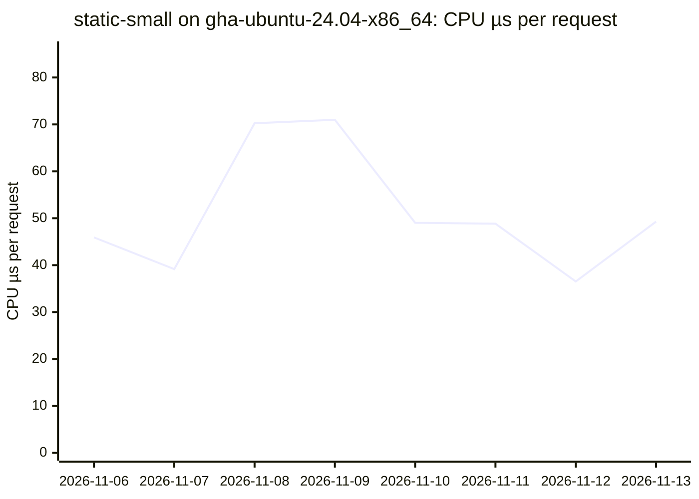
```mermaid
xychart-beta
  title "static-small on gha-ubuntu-24.04-x86_64: CPU µs per request"
  x-axis ["2026-11-06", "2026-11-07", "2026-11-08", "2026-11-09", "2026-11-10", "2026-11-11", "2026-11-12", "2026-11-13"]
  y-axis "CPU µs per request" 0 --> 86
  line [45.92, 39.16, 70.24, 70.98, 49.03, 48.84, 36.52, 49.28]
```

### `static-large` on `gha-ubuntu-24.04-x86_64`

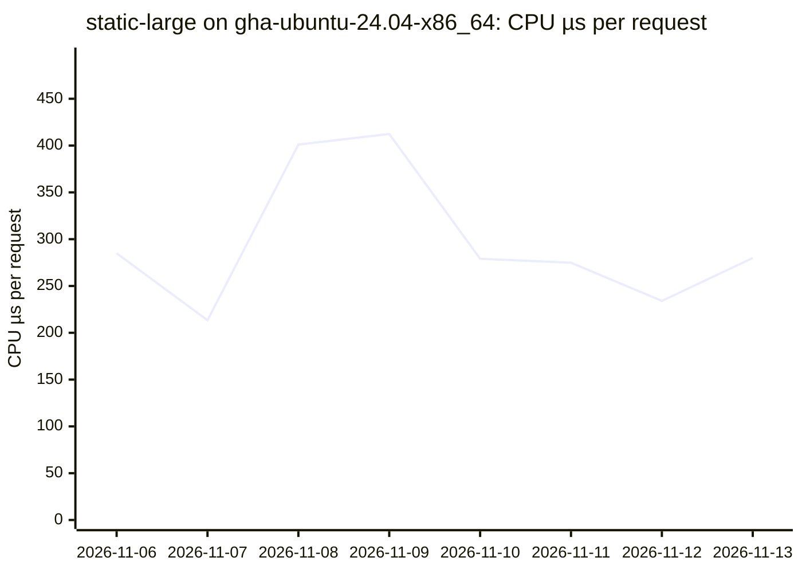
```mermaid
xychart-beta
  title "static-large on gha-ubuntu-24.04-x86_64: CPU µs per request"
  x-axis ["2026-11-06", "2026-11-07", "2026-11-08", "2026-11-09", "2026-11-10", "2026-11-11", "2026-11-12", "2026-11-13"]
  y-axis "CPU µs per request" 0 --> 495
  line [284.94, 213.45, 401.07, 412.38, 279.07, 274.87, 234.03, 279.86]
```

### `static-fresh` on `gha-ubuntu-24.04-x86_64`

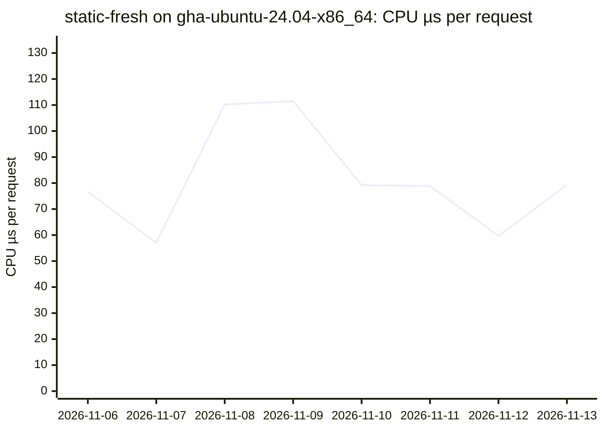
```mermaid
xychart-beta
  title "static-fresh on gha-ubuntu-24.04-x86_64: CPU µs per request"
  x-axis ["2026-11-06", "2026-11-07", "2026-11-08", "2026-11-09", "2026-11-10", "2026-11-11", "2026-11-12", "2026-11-13"]
  y-axis "CPU µs per request" 0 --> 134
  line [76.72, 57.05, 110.20, 111.47, 79.20, 78.85, 59.65, 79.31]
```

### `proxy-small` on `gha-ubuntu-24.04-x86_64`

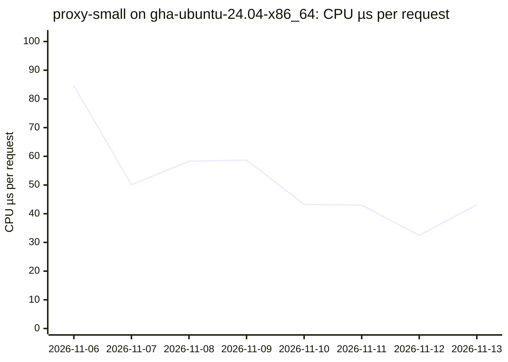
```mermaid
xychart-beta
  title "proxy-small on gha-ubuntu-24.04-x86_64: CPU µs per request"
  x-axis ["2026-11-06", "2026-11-07", "2026-11-08", "2026-11-09", "2026-11-10", "2026-11-11", "2026-11-12", "2026-11-13"]
  y-axis "CPU µs per request" 0 --> 102
  line [84.61, 50.09, 58.29, 58.68, 43.27, 43.00, 32.44, 43.10]
```

### `proxy-fresh` on `gha-ubuntu-24.04-x86_64`

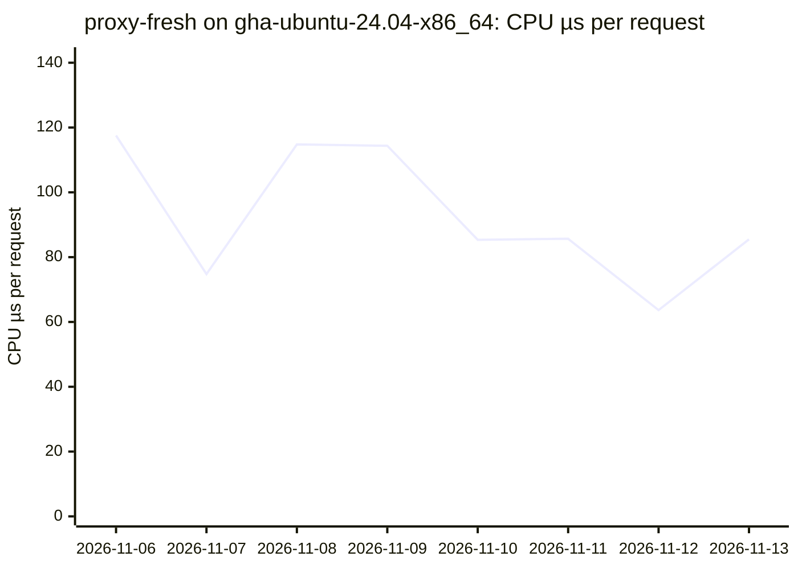
```mermaid
xychart-beta
  title "proxy-fresh on gha-ubuntu-24.04-x86_64: CPU µs per request"
  x-axis ["2026-11-06", "2026-11-07", "2026-11-08", "2026-11-09", "2026-11-10", "2026-11-11", "2026-11-12", "2026-11-13"]
  y-axis "CPU µs per request" 0 --> 142
  line [117.55, 74.78, 114.80, 114.37, 85.35, 85.68, 63.64, 85.50]
```

### `proxy-large` on `gha-ubuntu-24.04-x86_64`

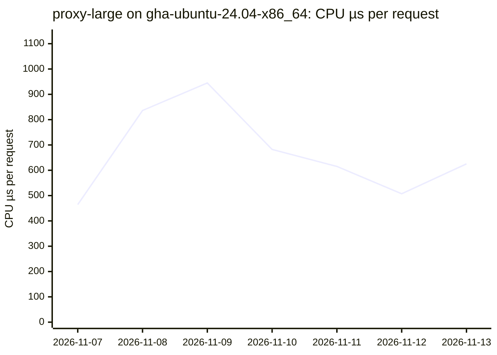
```mermaid
xychart-beta
  title "proxy-large on gha-ubuntu-24.04-x86_64: CPU µs per request"
  x-axis ["2026-11-07", "2026-11-08", "2026-11-09", "2026-11-10", "2026-11-11", "2026-11-12", "2026-11-13"]
  y-axis "CPU µs per request" 0 --> 1134
  line [464.25, 836.13, 944.91, 682.24, 615.25, 507.25, 625.31]
```

### `proxy-file` on `gha-ubuntu-24.04-x86_64`

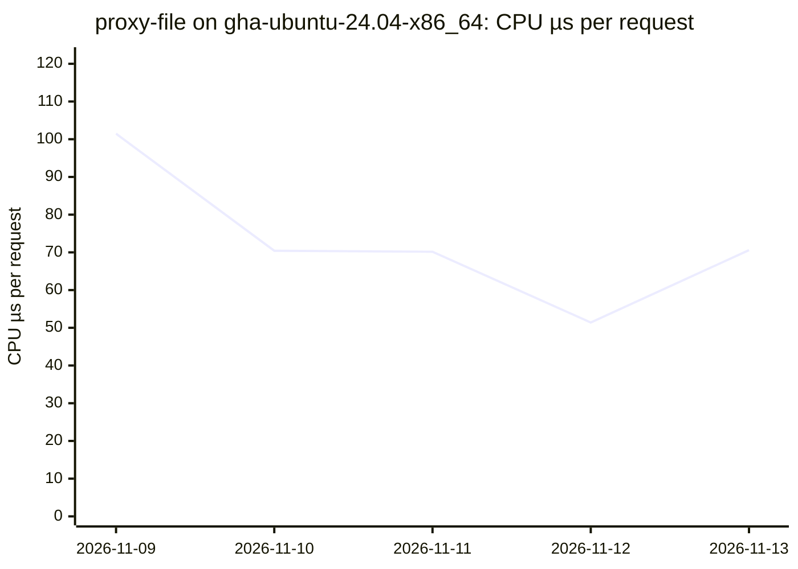
```mermaid
xychart-beta
  title "proxy-file on gha-ubuntu-24.04-x86_64: CPU µs per request"
  x-axis ["2026-11-09", "2026-11-10", "2026-11-11", "2026-11-12", "2026-11-13"]
  y-axis "CPU µs per request" 0 --> 122
  line [101.47, 70.43, 70.16, 51.41, 70.59]
```

### `conditional-hit` on `gha-ubuntu-24.04-x86_64`

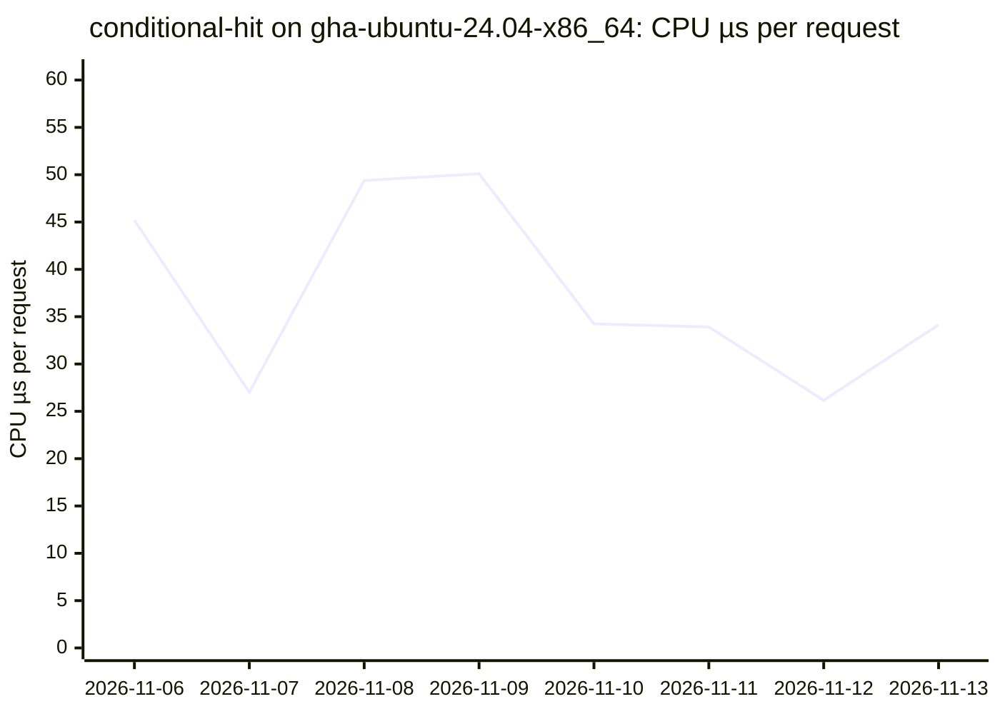
```mermaid
xychart-beta
  title "conditional-hit on gha-ubuntu-24.04-x86_64: CPU µs per request"
  x-axis ["2026-11-06", "2026-11-07", "2026-11-08", "2026-11-09", "2026-11-10", "2026-11-11", "2026-11-12", "2026-11-13"]
  y-axis "CPU µs per request" 0 --> 61
  line [45.19, 27.01, 49.38, 50.10, 34.25, 33.91, 26.17, 34.15]
```

### `static-small-1k-idle` on `gha-ubuntu-24.04-x86_64`

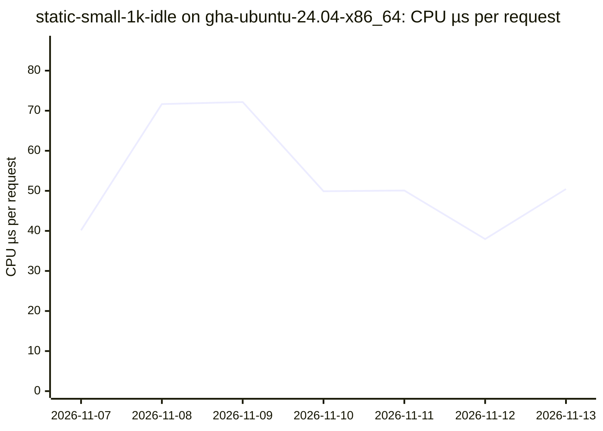
```mermaid
xychart-beta
  title "static-small-1k-idle on gha-ubuntu-24.04-x86_64: CPU µs per request"
  x-axis ["2026-11-07", "2026-11-08", "2026-11-09", "2026-11-10", "2026-11-11", "2026-11-12", "2026-11-13"]
  y-axis "CPU µs per request" 0 --> 87
  line [40.14, 71.65, 72.17, 49.90, 50.08, 37.97, 50.44]
```

## System calls per request

### `static-small` on `gha-ubuntu-24.04-x86_64`

```mermaid
xychart-beta
  title "static-small on gha-ubuntu-24.04-x86_64: system calls per request"
  x-axis ["2026-11-06", "2026-11-07", "2026-11-08", "2026-11-09", "2026-11-10", "2026-11-11", "2026-11-12", "2026-11-13"]
  y-axis "system calls per request" 0 --> 23
  line [19.04, 18.44, 17.80, 17.82, 17.79, 17.82, 17.97, 17.80]
```

### `static-large` on `gha-ubuntu-24.04-x86_64`

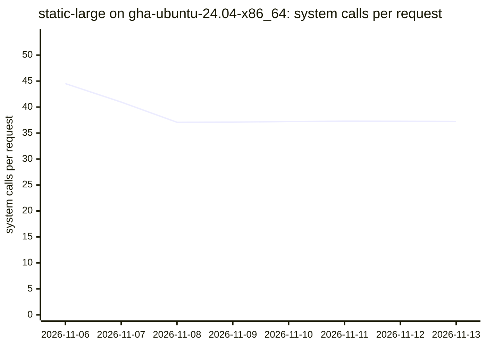
```mermaid
xychart-beta
  title "static-large on gha-ubuntu-24.04-x86_64: system calls per request"
  x-axis ["2026-11-06", "2026-11-07", "2026-11-08", "2026-11-09", "2026-11-10", "2026-11-11", "2026-11-12", "2026-11-13"]
  y-axis "system calls per request" 0 --> 54
  line [44.52, 40.96, 37.07, 37.09, 37.22, 37.28, 37.27, 37.23]
```

### `static-fresh` on `gha-ubuntu-24.04-x86_64`

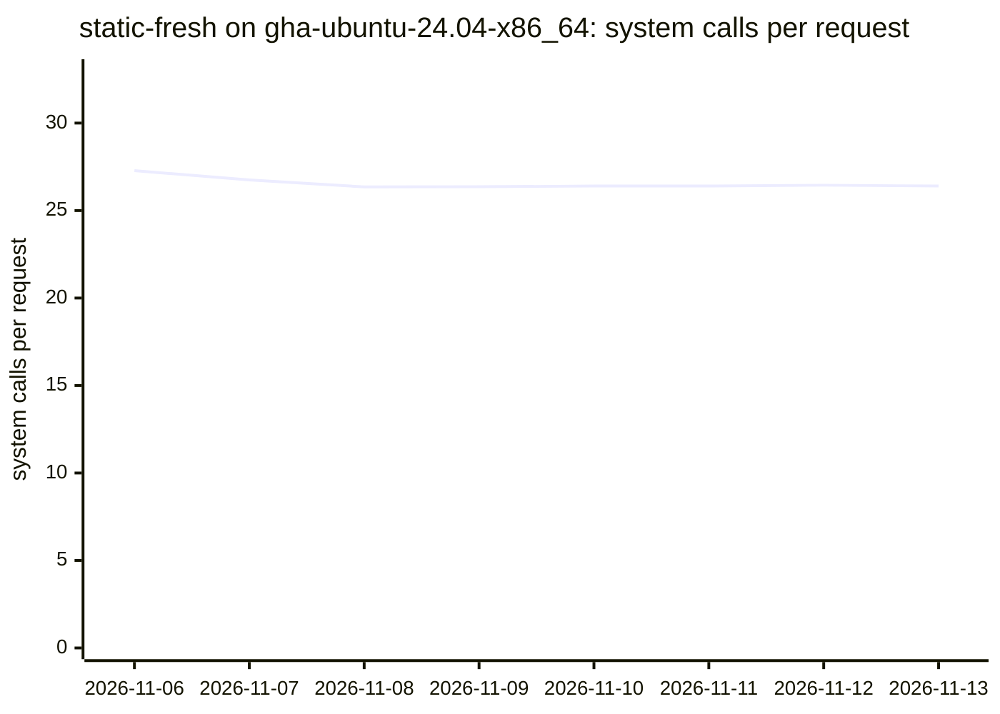
```mermaid
xychart-beta
  title "static-fresh on gha-ubuntu-24.04-x86_64: system calls per request"
  x-axis ["2026-11-06", "2026-11-07", "2026-11-08", "2026-11-09", "2026-11-10", "2026-11-11", "2026-11-12", "2026-11-13"]
  y-axis "system calls per request" 0 --> 33
  line [27.28, 26.75, 26.35, 26.36, 26.40, 26.40, 26.45, 26.40]
```

### `proxy-small` on `gha-ubuntu-24.04-x86_64`

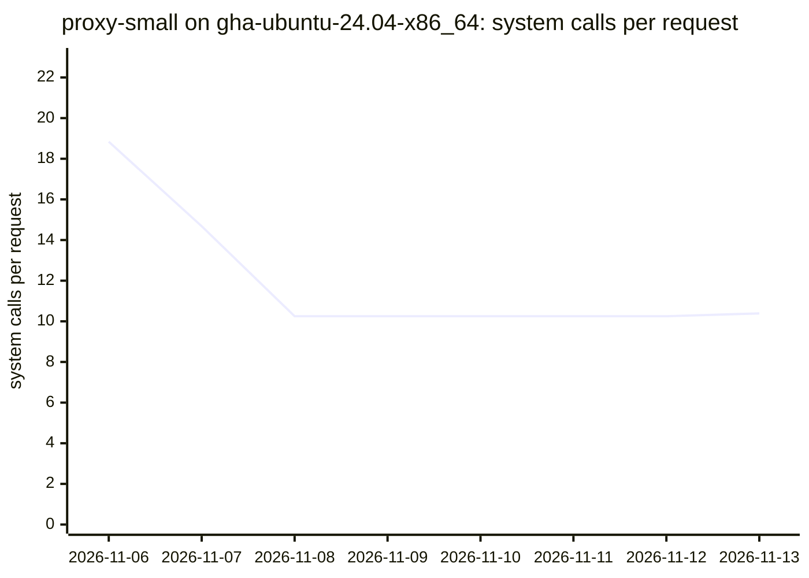
```mermaid
xychart-beta
  title "proxy-small on gha-ubuntu-24.04-x86_64: system calls per request"
  x-axis ["2026-11-06", "2026-11-07", "2026-11-08", "2026-11-09", "2026-11-10", "2026-11-11", "2026-11-12", "2026-11-13"]
  y-axis "system calls per request" 0 --> 23
  line [18.84, 14.68, 10.25, 10.25, 10.25, 10.25, 10.25, 10.39]
```

### `proxy-fresh` on `gha-ubuntu-24.04-x86_64`

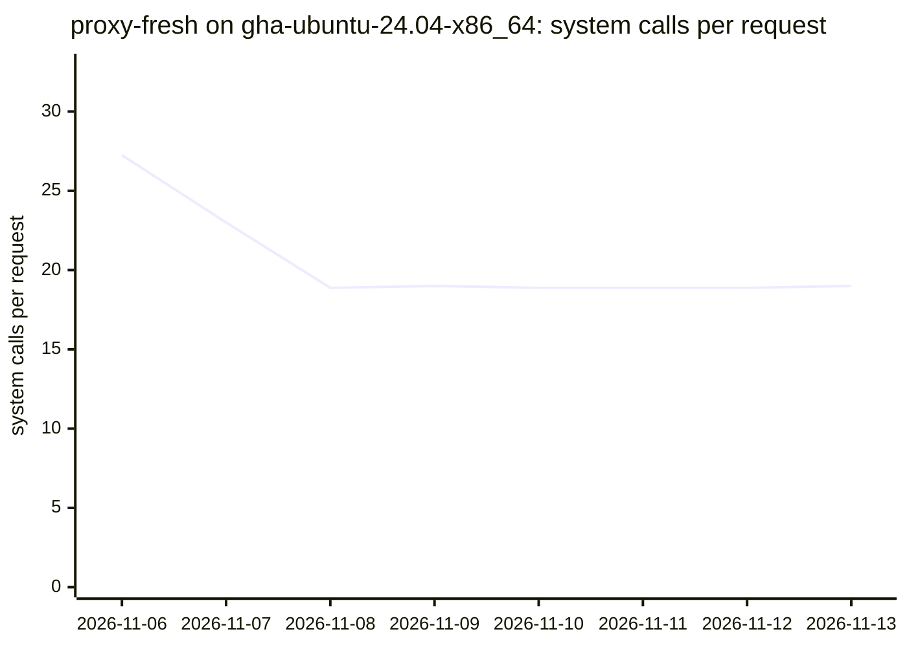
```mermaid
xychart-beta
  title "proxy-fresh on gha-ubuntu-24.04-x86_64: system calls per request"
  x-axis ["2026-11-06", "2026-11-07", "2026-11-08", "2026-11-09", "2026-11-10", "2026-11-11", "2026-11-12", "2026-11-13"]
  y-axis "system calls per request" 0 --> 33
  line [27.25, 23.00, 18.88, 19.00, 18.88, 18.88, 18.88, 19.00]
```

### `proxy-large` on `gha-ubuntu-24.04-x86_64`

```mermaid
xychart-beta
  title "proxy-large on gha-ubuntu-24.04-x86_64: system calls per request"
  x-axis ["2026-11-07", "2026-11-08", "2026-11-09", "2026-11-10", "2026-11-11", "2026-11-12", "2026-11-13"]
  y-axis "system calls per request" 0 --> 92
  line [74.97, 74.98, 74.98, 74.97, 75.19, 76.18, 74.97]
```

### `proxy-file` on `gha-ubuntu-24.04-x86_64`

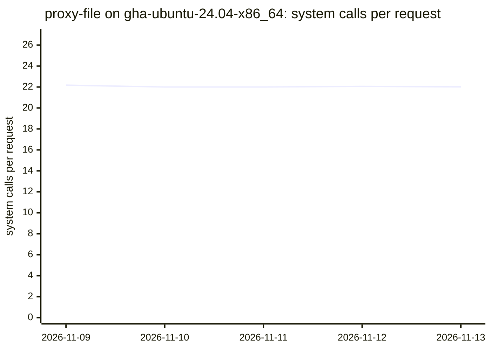
```mermaid
xychart-beta
  title "proxy-file on gha-ubuntu-24.04-x86_64: system calls per request"
  x-axis ["2026-11-09", "2026-11-10", "2026-11-11", "2026-11-12", "2026-11-13"]
  y-axis "system calls per request" 0 --> 27
  line [22.18, 22.00, 22.00, 22.06, 22.01]
```

### `conditional-hit` on `gha-ubuntu-24.04-x86_64`

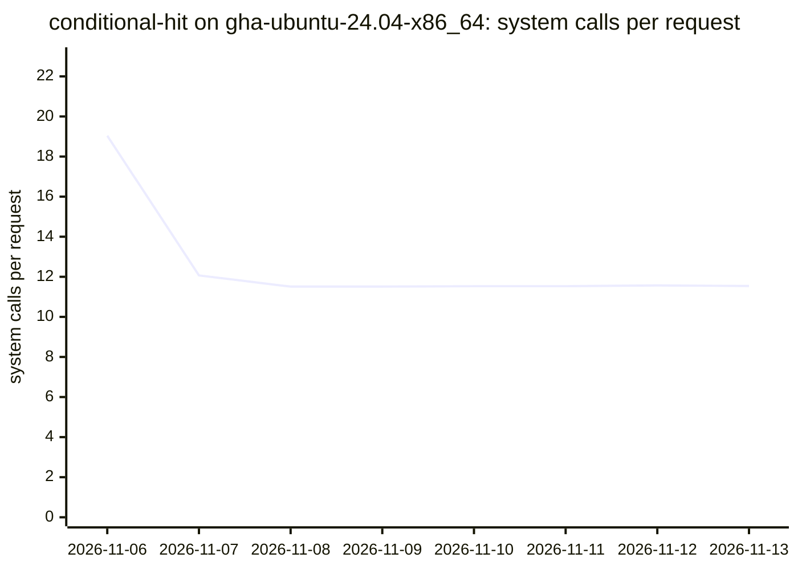
```mermaid
xychart-beta
  title "conditional-hit on gha-ubuntu-24.04-x86_64: system calls per request"
  x-axis ["2026-11-06", "2026-11-07", "2026-11-08", "2026-11-09", "2026-11-10", "2026-11-11", "2026-11-12", "2026-11-13"]
  y-axis "system calls per request" 0 --> 23
  line [19.04, 12.07, 11.51, 11.51, 11.53, 11.53, 11.57, 11.54]
```

### `static-small-1k-idle` on `gha-ubuntu-24.04-x86_64`

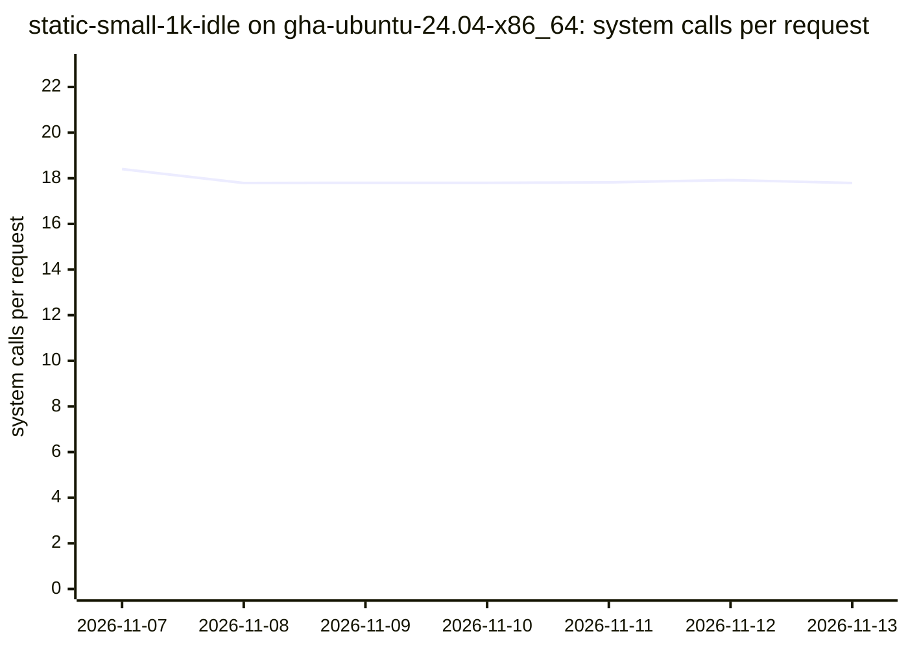
```mermaid
xychart-beta
  title "static-small-1k-idle on gha-ubuntu-24.04-x86_64: system calls per request"
  x-axis ["2026-11-07", "2026-11-08", "2026-11-09", "2026-11-10", "2026-11-11", "2026-11-12", "2026-11-13"]
  y-axis "system calls per request" 0 --> 23
  line [18.40, 17.79, 17.80, 17.80, 17.82, 17.92, 17.79]
```
