# Benchmarks

CPU time and system calls per request of the `durchlauferhitzer` binary, per scenario, measured nightly on GitHub's runners (NFR-PERF-08; data: [`results.csv`](results.csv), tool: `bench/` on `main`).

Method: CPU time is the server process's own utime+stime (`/proc/<pid>/stat`) over the measured window after a warm-up, divided by the complete, correct responses; system calls come from a separate `strace -c -f` pass, divided by that pass's responses.
Each point is the median of a date's runs on one runner (each runner label is its own series); runs with errors are left out (they stay in the CSV). Runner noise is expected: compare trends, not single points.

## Latest

| Scenario | Runner | Date | Commit | CPU µs/req | Syscalls/req | Req/s | RSS KiB |
|---|---|---|---|---:|---:|---:|---:|
| `static-small` | `gha-ubuntu-24.04-x86_64` | 2026-11-20 | `500013a` | 23.32 | 17.96 | 73194 | 3016 |
| `static-large` | `gha-ubuntu-24.04-x86_64` | 2026-11-20 | `500013a` | 139.78 | 37.21 | 9756 | 3024 |
| `static-fresh` | `gha-ubuntu-24.04-x86_64` | 2026-11-20 | `500013a` | 39.07 | 26.54 | 35754 | 3056 |
| `proxy-small` | `gha-ubuntu-24.04-x86_64` | 2026-11-20 | `500013a` | 20.68 | 10.63 | 48309 | 3136 |
| `proxy-fresh` | `gha-ubuntu-24.04-x86_64` | 2026-11-20 | `500013a` | 37.37 | 18.88 | 26635 | 3140 |
| `proxy-large` | `gha-ubuntu-24.04-x86_64` | 2026-11-20 | `500013a` | 380.60 | 77.96 | 2611 | 20408 |
| `proxy-file` | `gha-ubuntu-24.04-x86_64` | 2026-11-20 | `500013a` | 35.05 | 22.11 | 41114 | 3416 |
| `conditional-hit` | `gha-ubuntu-24.04-x86_64` | 2026-11-20 | `500013a` | 16.95 | 11.59 | 90136 | 3140 |
| `static-small-1k-idle` | `gha-ubuntu-24.04-x86_64` | 2026-11-20 | `500013a` | 25.47 | 17.96 | 67334 | 20396 |

## CPU time per request (µs)

### `static-small` on `gha-ubuntu-24.04-x86_64`

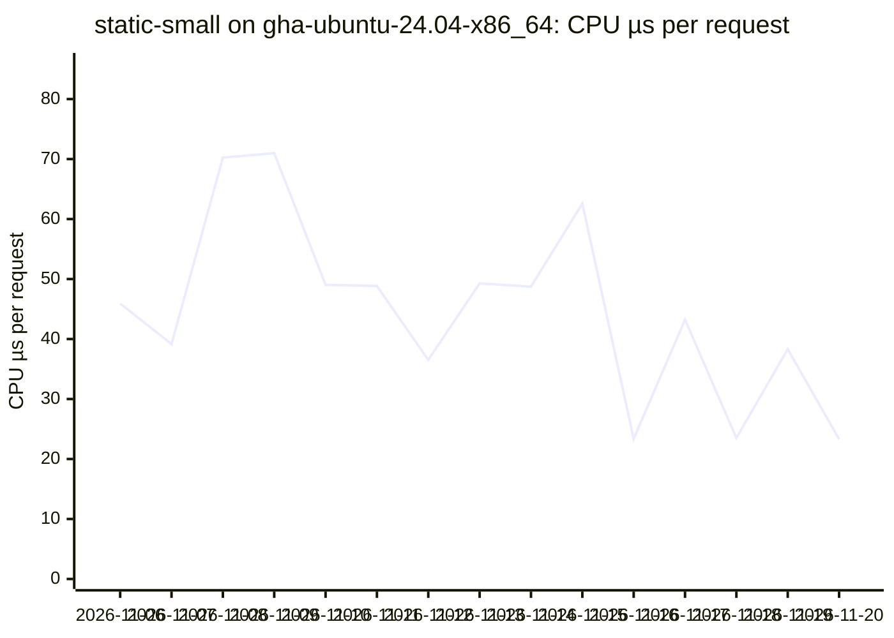
```mermaid
xychart-beta
  title "static-small on gha-ubuntu-24.04-x86_64: CPU µs per request"
  x-axis ["2026-11-06", "2026-11-07", "2026-11-08", "2026-11-09", "2026-11-10", "2026-11-11", "2026-11-12", "2026-11-13", "2026-11-14", "2026-11-15", "2026-11-16", "2026-11-17", "2026-11-18", "2026-11-19", "2026-11-20"]
  y-axis "CPU µs per request" 0 --> 86
  line [45.92, 39.16, 70.24, 70.98, 49.03, 48.84, 36.52, 49.28, 48.72, 62.58, 23.36, 43.23, 23.51, 38.31, 23.32]
```

### `static-large` on `gha-ubuntu-24.04-x86_64`

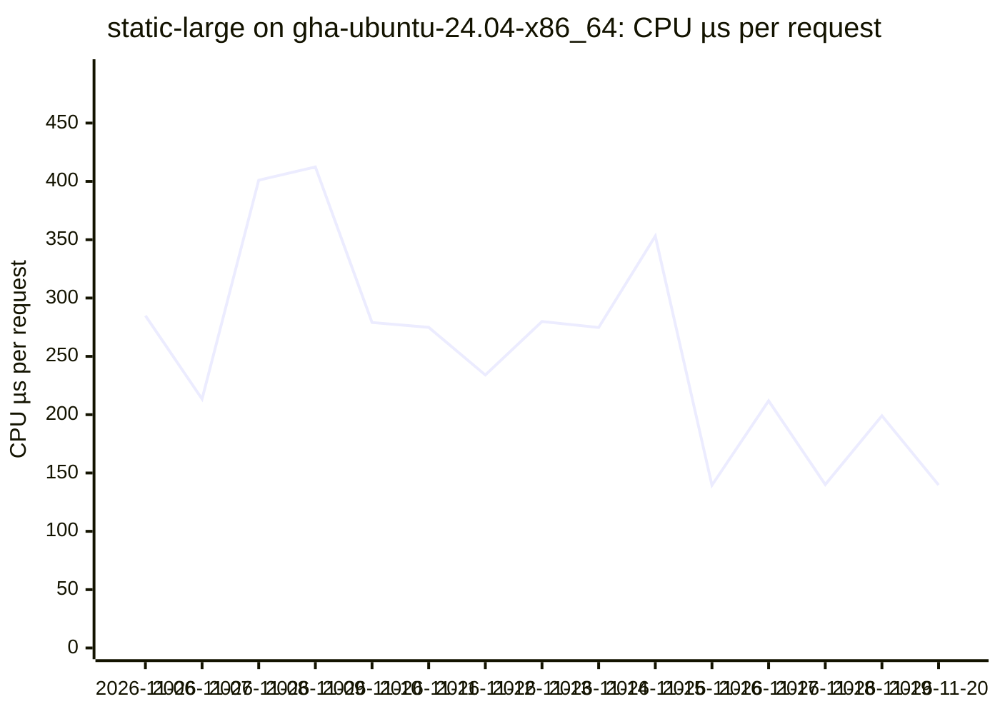
```mermaid
xychart-beta
  title "static-large on gha-ubuntu-24.04-x86_64: CPU µs per request"
  x-axis ["2026-11-06", "2026-11-07", "2026-11-08", "2026-11-09", "2026-11-10", "2026-11-11", "2026-11-12", "2026-11-13", "2026-11-14", "2026-11-15", "2026-11-16", "2026-11-17", "2026-11-18", "2026-11-19", "2026-11-20"]
  y-axis "CPU µs per request" 0 --> 495
  line [284.94, 213.45, 401.07, 412.38, 279.07, 274.87, 234.03, 279.86, 274.69, 353.06, 139.52, 211.93, 140.10, 199.06, 139.78]
```

### `static-fresh` on `gha-ubuntu-24.04-x86_64`

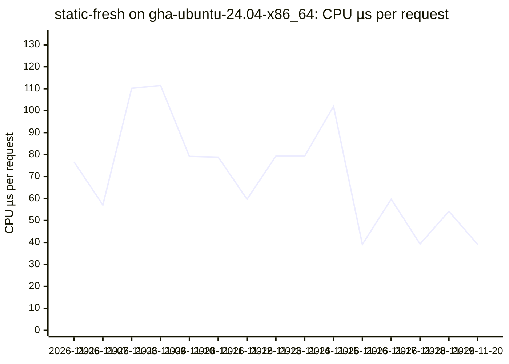
```mermaid
xychart-beta
  title "static-fresh on gha-ubuntu-24.04-x86_64: CPU µs per request"
  x-axis ["2026-11-06", "2026-11-07", "2026-11-08", "2026-11-09", "2026-11-10", "2026-11-11", "2026-11-12", "2026-11-13", "2026-11-14", "2026-11-15", "2026-11-16", "2026-11-17", "2026-11-18", "2026-11-19", "2026-11-20"]
  y-axis "CPU µs per request" 0 --> 134
  line [76.72, 57.05, 110.20, 111.47, 79.20, 78.85, 59.65, 79.31, 79.31, 101.98, 39.10, 59.71, 39.31, 54.16, 39.07]
```

### `proxy-small` on `gha-ubuntu-24.04-x86_64`

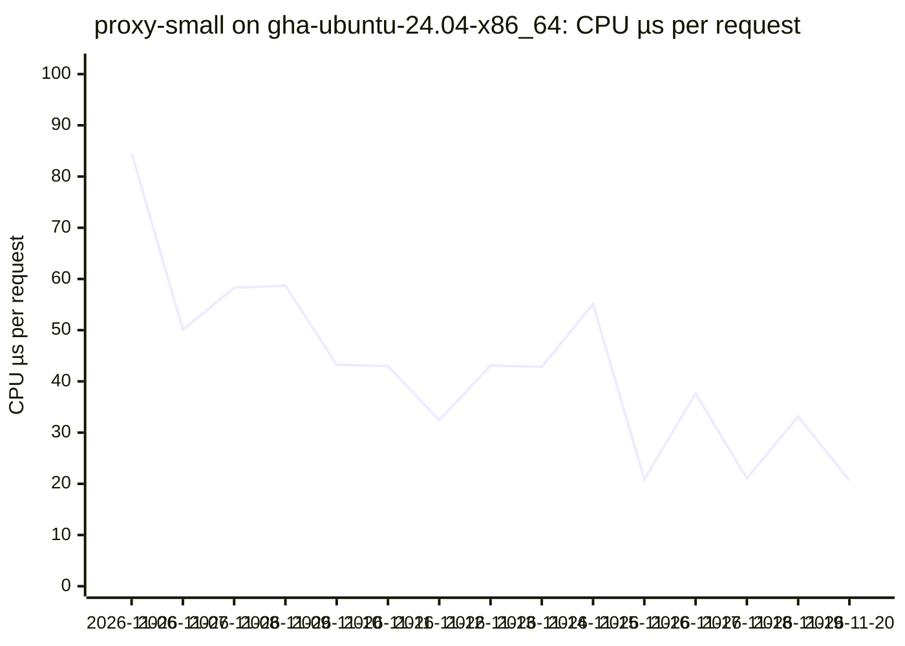
```mermaid
xychart-beta
  title "proxy-small on gha-ubuntu-24.04-x86_64: CPU µs per request"
  x-axis ["2026-11-06", "2026-11-07", "2026-11-08", "2026-11-09", "2026-11-10", "2026-11-11", "2026-11-12", "2026-11-13", "2026-11-14", "2026-11-15", "2026-11-16", "2026-11-17", "2026-11-18", "2026-11-19", "2026-11-20"]
  y-axis "CPU µs per request" 0 --> 102
  line [84.61, 50.09, 58.29, 58.68, 43.27, 43.00, 32.44, 43.10, 42.86, 55.11, 20.87, 37.61, 21.08, 33.14, 20.68]
```

### `proxy-fresh` on `gha-ubuntu-24.04-x86_64`

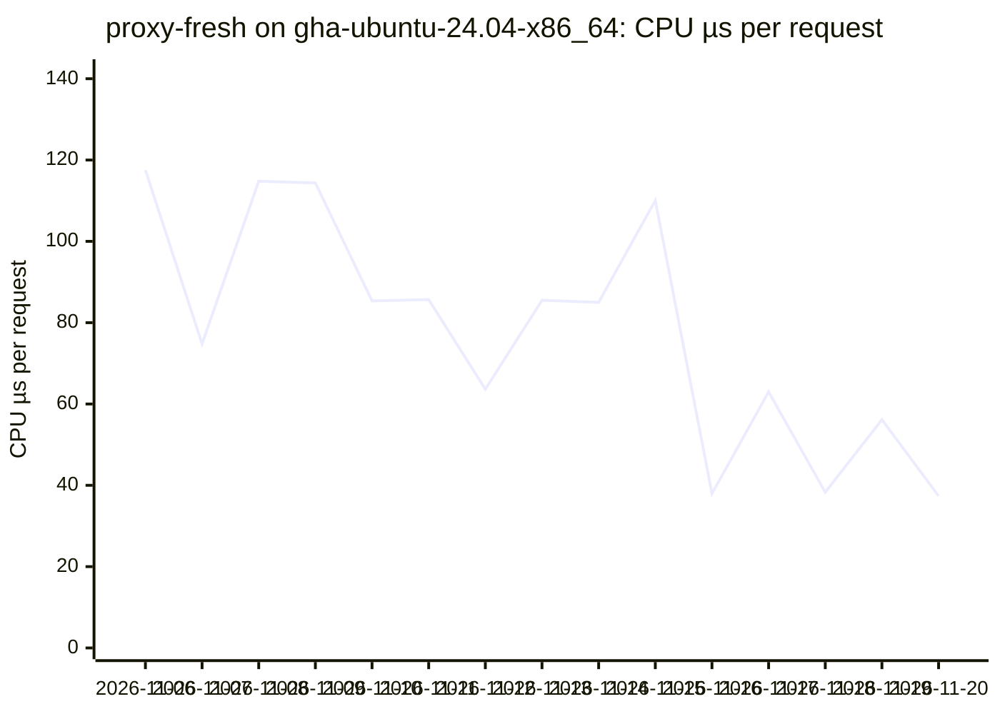
```mermaid
xychart-beta
  title "proxy-fresh on gha-ubuntu-24.04-x86_64: CPU µs per request"
  x-axis ["2026-11-06", "2026-11-07", "2026-11-08", "2026-11-09", "2026-11-10", "2026-11-11", "2026-11-12", "2026-11-13", "2026-11-14", "2026-11-15", "2026-11-16", "2026-11-17", "2026-11-18", "2026-11-19", "2026-11-20"]
  y-axis "CPU µs per request" 0 --> 142
  line [117.55, 74.78, 114.80, 114.37, 85.35, 85.68, 63.64, 85.50, 85.00, 110.06, 37.96, 63.00, 38.27, 56.15, 37.37]
```

### `proxy-large` on `gha-ubuntu-24.04-x86_64`

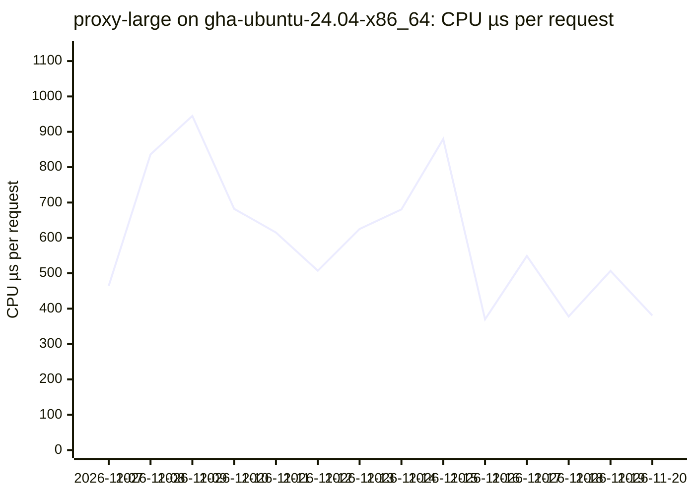
```mermaid
xychart-beta
  title "proxy-large on gha-ubuntu-24.04-x86_64: CPU µs per request"
  x-axis ["2026-11-07", "2026-11-08", "2026-11-09", "2026-11-10", "2026-11-11", "2026-11-12", "2026-11-13", "2026-11-14", "2026-11-15", "2026-11-16", "2026-11-17", "2026-11-18", "2026-11-19", "2026-11-20"]
  y-axis "CPU µs per request" 0 --> 1134
  line [464.25, 836.13, 944.91, 682.24, 615.25, 507.25, 625.31, 680.39, 879.63, 369.62, 548.85, 377.75, 506.62, 380.60]
```

### `proxy-file` on `gha-ubuntu-24.04-x86_64`

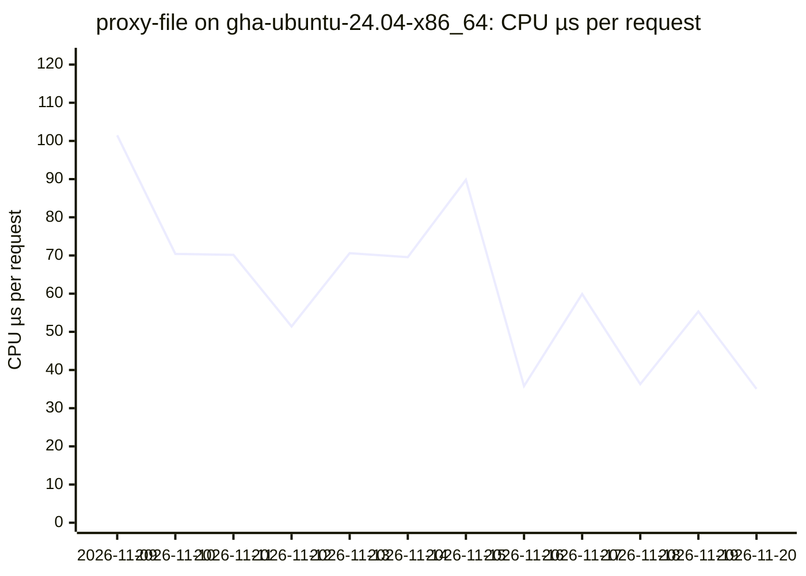
```mermaid
xychart-beta
  title "proxy-file on gha-ubuntu-24.04-x86_64: CPU µs per request"
  x-axis ["2026-11-09", "2026-11-10", "2026-11-11", "2026-11-12", "2026-11-13", "2026-11-14", "2026-11-15", "2026-11-16", "2026-11-17", "2026-11-18", "2026-11-19", "2026-11-20"]
  y-axis "CPU µs per request" 0 --> 122
  line [101.47, 70.43, 70.16, 51.41, 70.59, 69.57, 89.81, 35.79, 59.91, 36.30, 55.32, 35.05]
```

### `conditional-hit` on `gha-ubuntu-24.04-x86_64`

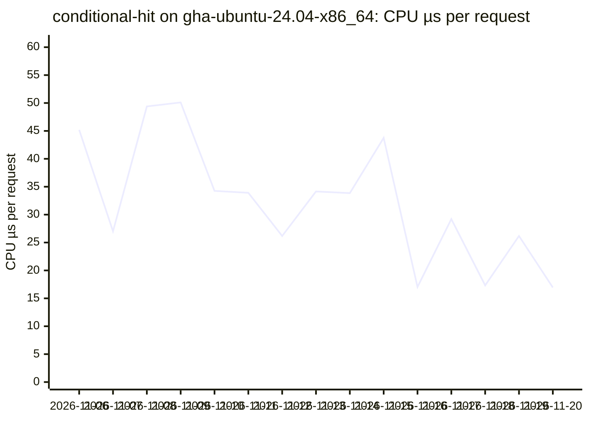
```mermaid
xychart-beta
  title "conditional-hit on gha-ubuntu-24.04-x86_64: CPU µs per request"
  x-axis ["2026-11-06", "2026-11-07", "2026-11-08", "2026-11-09", "2026-11-10", "2026-11-11", "2026-11-12", "2026-11-13", "2026-11-14", "2026-11-15", "2026-11-16", "2026-11-17", "2026-11-18", "2026-11-19", "2026-11-20"]
  y-axis "CPU µs per request" 0 --> 61
  line [45.19, 27.01, 49.38, 50.10, 34.25, 33.91, 26.17, 34.15, 33.85, 43.76, 17.04, 29.21, 17.33, 26.18, 16.95]
```

### `static-small-1k-idle` on `gha-ubuntu-24.04-x86_64`

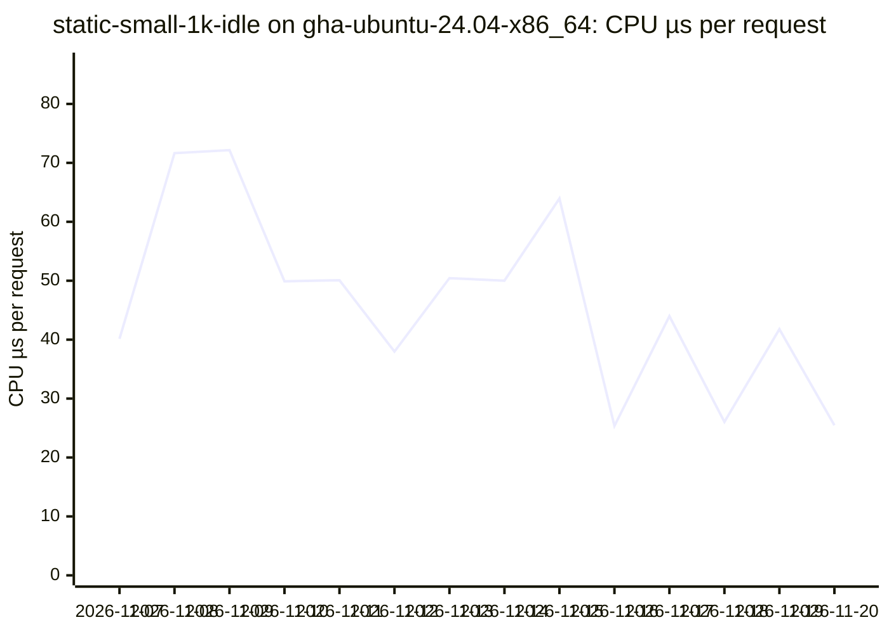
```mermaid
xychart-beta
  title "static-small-1k-idle on gha-ubuntu-24.04-x86_64: CPU µs per request"
  x-axis ["2026-11-07", "2026-11-08", "2026-11-09", "2026-11-10", "2026-11-11", "2026-11-12", "2026-11-13", "2026-11-14", "2026-11-15", "2026-11-16", "2026-11-17", "2026-11-18", "2026-11-19", "2026-11-20"]
  y-axis "CPU µs per request" 0 --> 87
  line [40.14, 71.65, 72.17, 49.90, 50.08, 37.97, 50.44, 50.01, 63.94, 25.36, 43.98, 26.04, 41.77, 25.47]
```

## System calls per request

### `static-small` on `gha-ubuntu-24.04-x86_64`

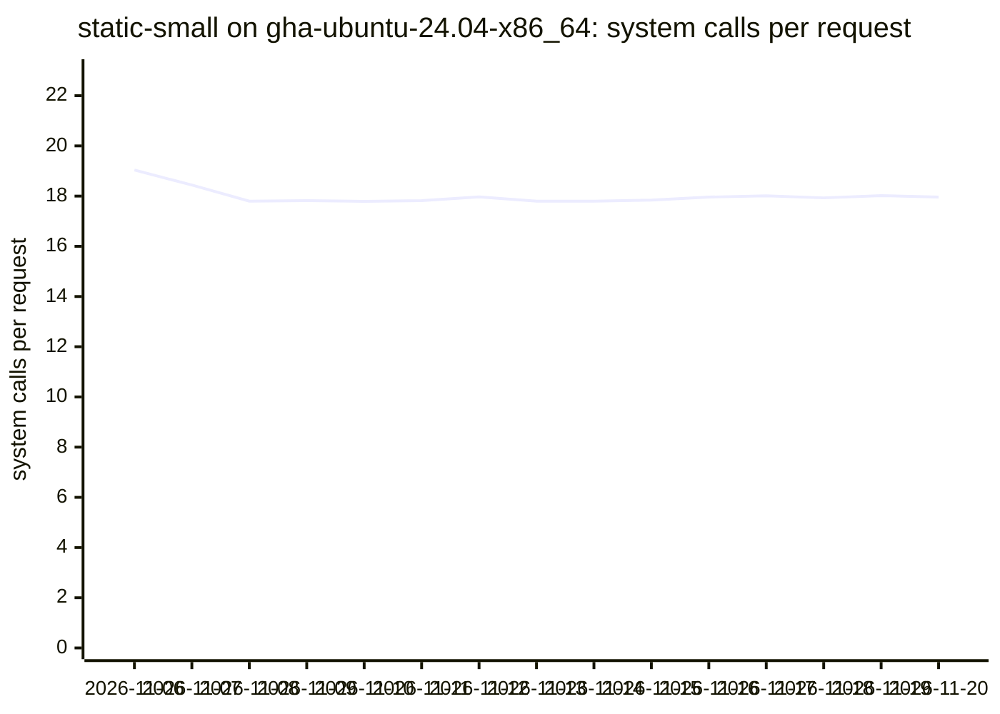
```mermaid
xychart-beta
  title "static-small on gha-ubuntu-24.04-x86_64: system calls per request"
  x-axis ["2026-11-06", "2026-11-07", "2026-11-08", "2026-11-09", "2026-11-10", "2026-11-11", "2026-11-12", "2026-11-13", "2026-11-14", "2026-11-15", "2026-11-16", "2026-11-17", "2026-11-18", "2026-11-19", "2026-11-20"]
  y-axis "system calls per request" 0 --> 23
  line [19.04, 18.44, 17.80, 17.82, 17.79, 17.82, 17.97, 17.80, 17.80, 17.84, 17.96, 18.01, 17.93, 18.02, 17.96]
```

### `static-large` on `gha-ubuntu-24.04-x86_64`

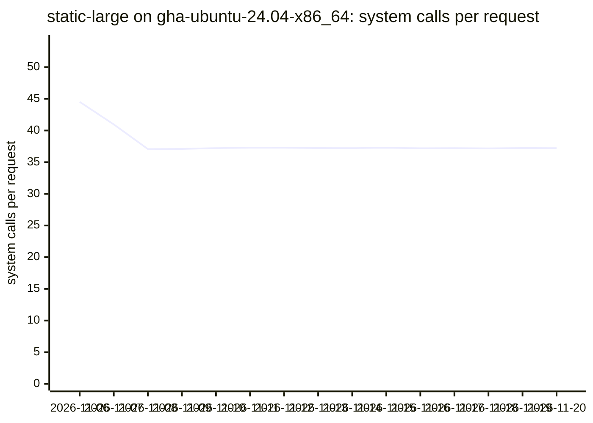
```mermaid
xychart-beta
  title "static-large on gha-ubuntu-24.04-x86_64: system calls per request"
  x-axis ["2026-11-06", "2026-11-07", "2026-11-08", "2026-11-09", "2026-11-10", "2026-11-11", "2026-11-12", "2026-11-13", "2026-11-14", "2026-11-15", "2026-11-16", "2026-11-17", "2026-11-18", "2026-11-19", "2026-11-20"]
  y-axis "system calls per request" 0 --> 54
  line [44.52, 40.96, 37.07, 37.09, 37.22, 37.28, 37.27, 37.23, 37.22, 37.27, 37.19, 37.21, 37.18, 37.23, 37.21]
```

### `static-fresh` on `gha-ubuntu-24.04-x86_64`

```mermaid
xychart-beta
  title "static-fresh on gha-ubuntu-24.04-x86_64: system calls per request"
  x-axis ["2026-11-06", "2026-11-07", "2026-11-08", "2026-11-09", "2026-11-10", "2026-11-11", "2026-11-12", "2026-11-13", "2026-11-14", "2026-11-15", "2026-11-16", "2026-11-17", "2026-11-18", "2026-11-19", "2026-11-20"]
  y-axis "system calls per request" 0 --> 33
  line [27.28, 26.75, 26.35, 26.36, 26.40, 26.40, 26.45, 26.40, 26.40, 26.41, 26.54, 26.55, 26.52, 26.54, 26.54]
```

### `proxy-small` on `gha-ubuntu-24.04-x86_64`

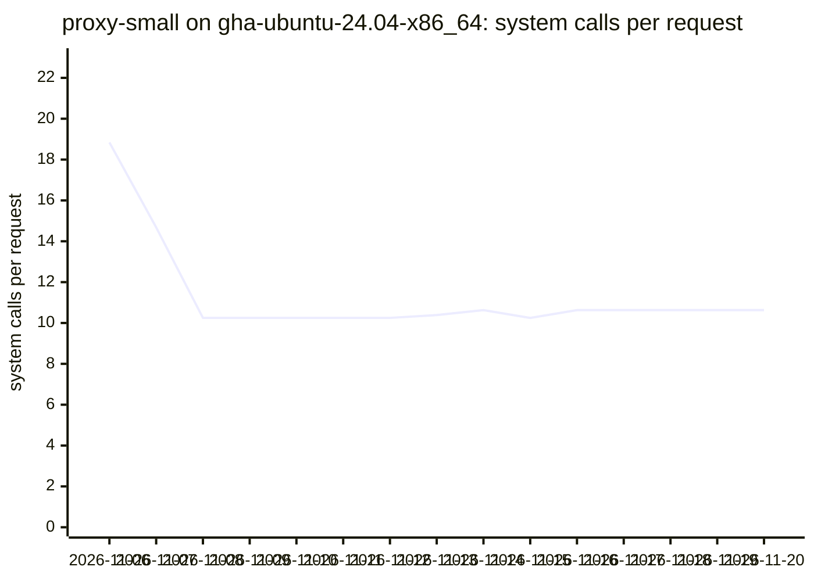
```mermaid
xychart-beta
  title "proxy-small on gha-ubuntu-24.04-x86_64: system calls per request"
  x-axis ["2026-11-06", "2026-11-07", "2026-11-08", "2026-11-09", "2026-11-10", "2026-11-11", "2026-11-12", "2026-11-13", "2026-11-14", "2026-11-15", "2026-11-16", "2026-11-17", "2026-11-18", "2026-11-19", "2026-11-20"]
  y-axis "system calls per request" 0 --> 23
  line [18.84, 14.68, 10.25, 10.25, 10.25, 10.25, 10.25, 10.39, 10.63, 10.25, 10.63, 10.63, 10.63, 10.63, 10.63]
```

### `proxy-fresh` on `gha-ubuntu-24.04-x86_64`

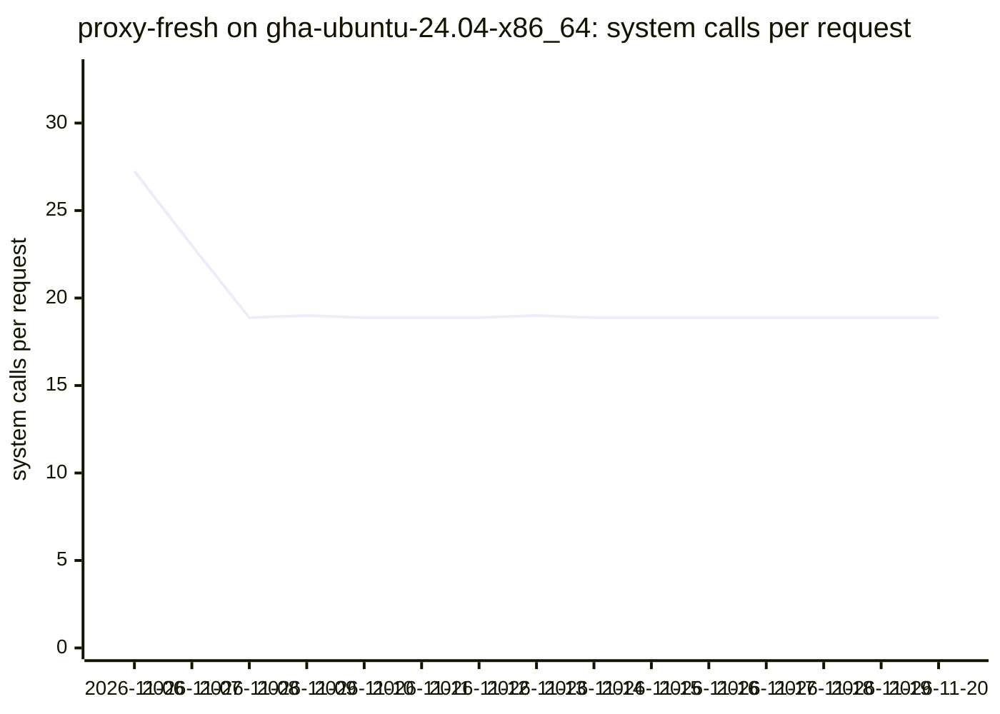
```mermaid
xychart-beta
  title "proxy-fresh on gha-ubuntu-24.04-x86_64: system calls per request"
  x-axis ["2026-11-06", "2026-11-07", "2026-11-08", "2026-11-09", "2026-11-10", "2026-11-11", "2026-11-12", "2026-11-13", "2026-11-14", "2026-11-15", "2026-11-16", "2026-11-17", "2026-11-18", "2026-11-19", "2026-11-20"]
  y-axis "system calls per request" 0 --> 33
  line [27.25, 23.00, 18.88, 19.00, 18.88, 18.88, 18.88, 19.00, 18.88, 18.88, 18.88, 18.88, 18.88, 18.88, 18.88]
```

### `proxy-large` on `gha-ubuntu-24.04-x86_64`

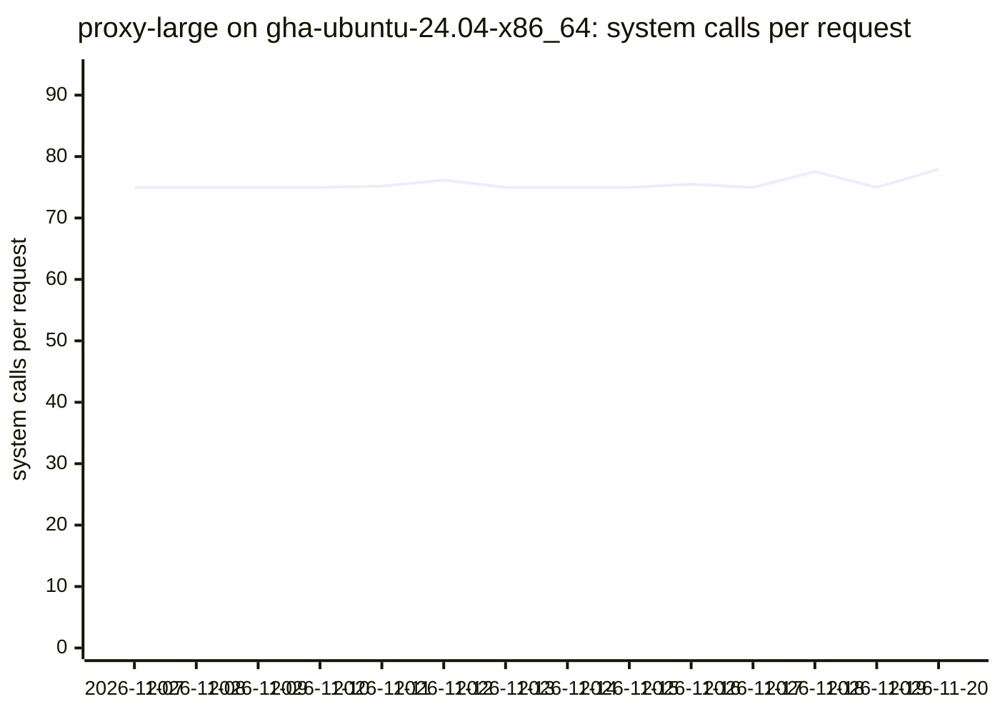
```mermaid
xychart-beta
  title "proxy-large on gha-ubuntu-24.04-x86_64: system calls per request"
  x-axis ["2026-11-07", "2026-11-08", "2026-11-09", "2026-11-10", "2026-11-11", "2026-11-12", "2026-11-13", "2026-11-14", "2026-11-15", "2026-11-16", "2026-11-17", "2026-11-18", "2026-11-19", "2026-11-20"]
  y-axis "system calls per request" 0 --> 94
  line [74.97, 74.98, 74.98, 74.97, 75.19, 76.18, 74.97, 74.97, 74.98, 75.49, 74.98, 77.56, 74.98, 77.96]
```

### `proxy-file` on `gha-ubuntu-24.04-x86_64`

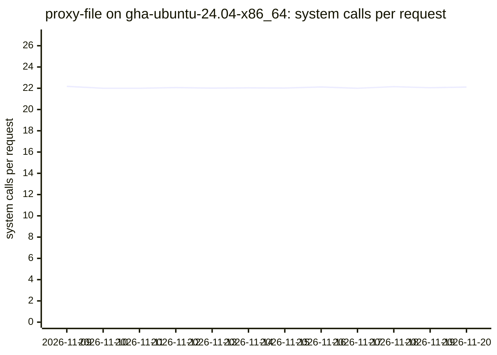
```mermaid
xychart-beta
  title "proxy-file on gha-ubuntu-24.04-x86_64: system calls per request"
  x-axis ["2026-11-09", "2026-11-10", "2026-11-11", "2026-11-12", "2026-11-13", "2026-11-14", "2026-11-15", "2026-11-16", "2026-11-17", "2026-11-18", "2026-11-19", "2026-11-20"]
  y-axis "system calls per request" 0 --> 27
  line [22.18, 22.00, 22.00, 22.06, 22.01, 22.04, 22.02, 22.12, 22.00, 22.15, 22.05, 22.11]
```

### `conditional-hit` on `gha-ubuntu-24.04-x86_64`

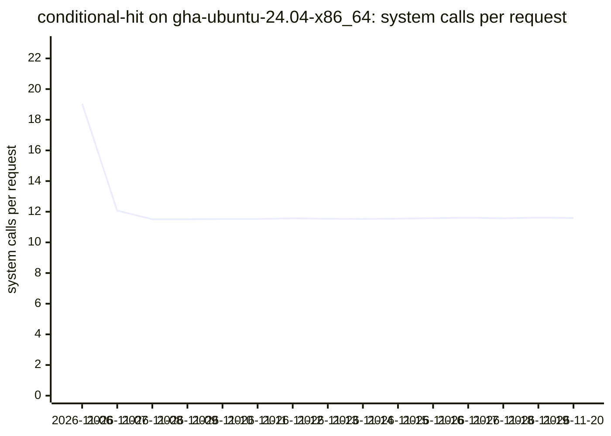
```mermaid
xychart-beta
  title "conditional-hit on gha-ubuntu-24.04-x86_64: system calls per request"
  x-axis ["2026-11-06", "2026-11-07", "2026-11-08", "2026-11-09", "2026-11-10", "2026-11-11", "2026-11-12", "2026-11-13", "2026-11-14", "2026-11-15", "2026-11-16", "2026-11-17", "2026-11-18", "2026-11-19", "2026-11-20"]
  y-axis "system calls per request" 0 --> 23
  line [19.04, 12.07, 11.51, 11.51, 11.53, 11.53, 11.57, 11.54, 11.53, 11.55, 11.58, 11.61, 11.57, 11.62, 11.59]
```

### `static-small-1k-idle` on `gha-ubuntu-24.04-x86_64`

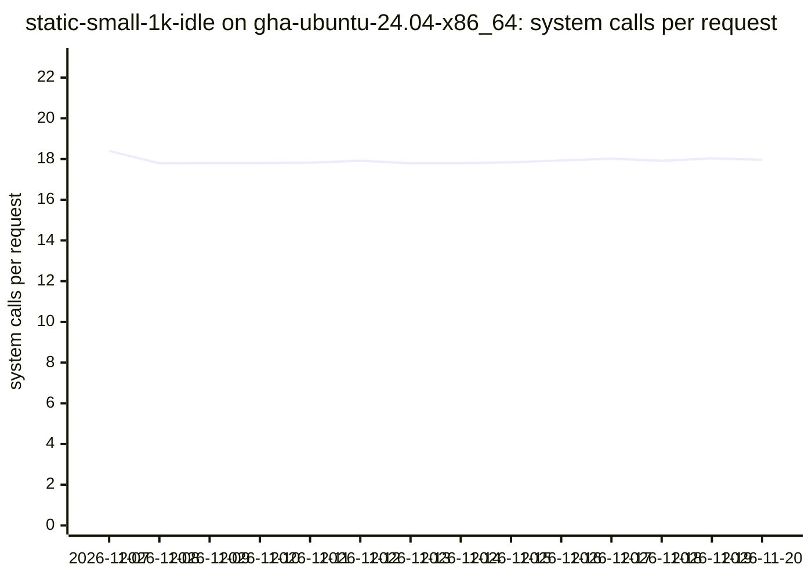
```mermaid
xychart-beta
  title "static-small-1k-idle on gha-ubuntu-24.04-x86_64: system calls per request"
  x-axis ["2026-11-07", "2026-11-08", "2026-11-09", "2026-11-10", "2026-11-11", "2026-11-12", "2026-11-13", "2026-11-14", "2026-11-15", "2026-11-16", "2026-11-17", "2026-11-18", "2026-11-19", "2026-11-20"]
  y-axis "system calls per request" 0 --> 23
  line [18.40, 17.79, 17.80, 17.80, 17.82, 17.92, 17.79, 17.79, 17.84, 17.93, 18.02, 17.91, 18.03, 17.96]
```

## Product source lines

The product's size, recorded by each nightly (NFR-MAINT-12).
It counts the non-blank, non-comment lines of `core/src` and `driver/src`.
Test code is left out.

The counting rule is `scripts/product-lines.py` on `main`.
The data is [`product-lines.csv`](product-lines.csv).

Each point is the last record of its date.

| Date | Commit | Lines |
|---|---|---:|
| 2026-11-20 | `500013a` | 15413 |

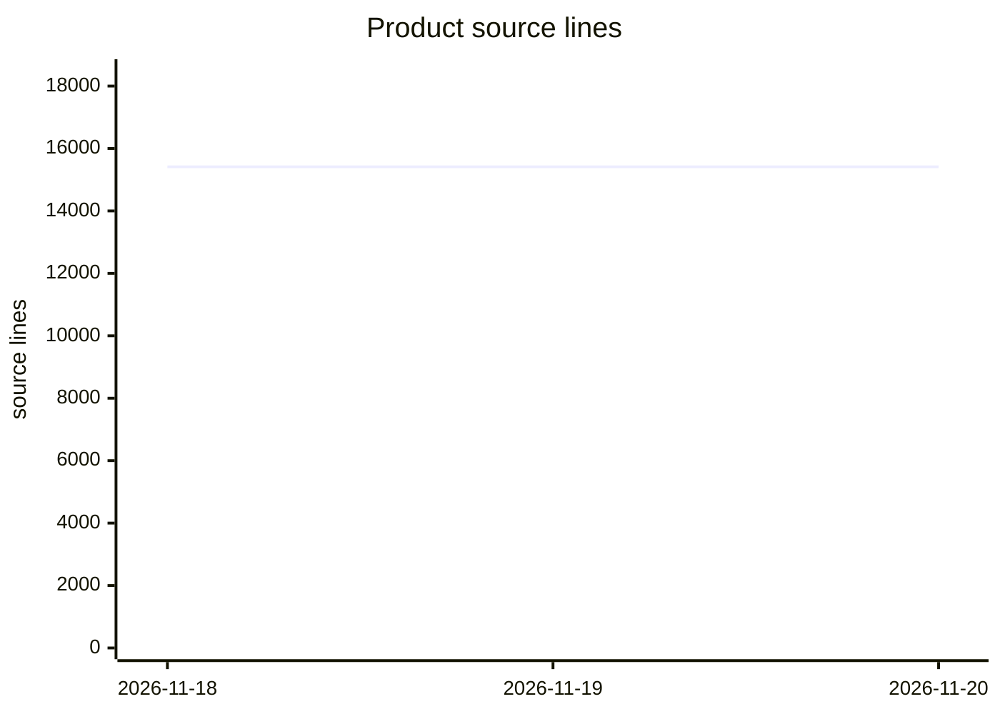
```mermaid
xychart-beta
  title "Product source lines"
  x-axis ["2026-11-18", "2026-11-19", "2026-11-20"]
  y-axis "source lines" 0 --> 18496
  line [15413, 15413, 15413]
```
